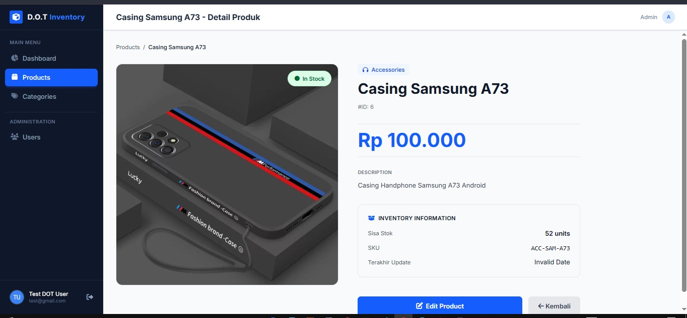
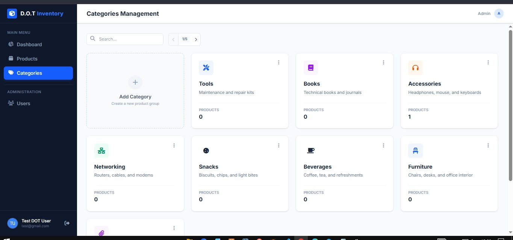
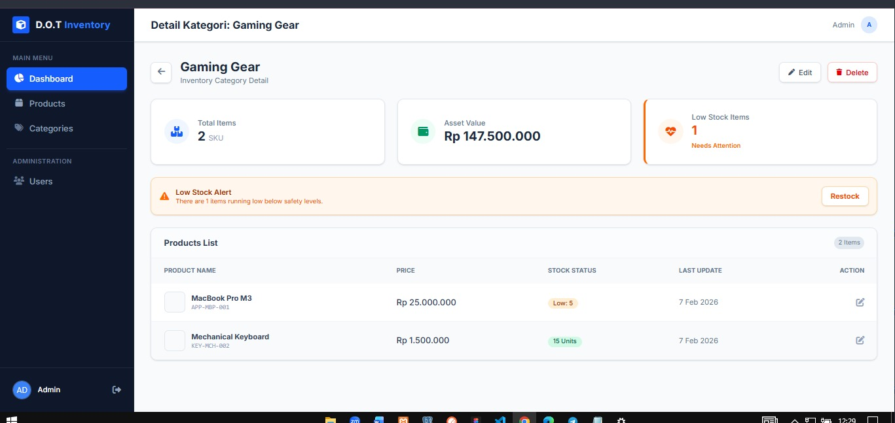

# 📦 DOT Inventory - Fullstack Management System

DOT Inventory is a modern, server-side rendered inventory management application designed to streamline product tracking and team collaboration. Built with **NestJS** and **TypeScript**, it strictly follows the **MVC (Model-View-Controller)** architecture pattern.

## 🚀 Features

### 📊 Dashboard & Analytics

- **Real-time Stats:** View total products, asset value, and category counts instantly.
- **Low Stock Alerts:** Visual indicators for items running low on stock.
- **Recent Activity:** Track recently added items.

### 📦 Product & Category Management (CRUD)

- **One-to-Many Relation:** Organize products under specific categories.
- **Dynamic Forms:** Add/Edit products with auto-populated category dropdowns.
- **Rich Data:** Manage stock levels, pricing (IDR currency), and descriptions.
- **Search & Pagination:** Efficient data retrieval with server-side pagination.

### 👥 User Management & Security

- **Secure Authentication:** Implementation of `bcrypt` for password hashing.
- **Role-Based Badges:** Visual distinction between Admin, Manager, and Staff.
- **Auto-Avatar:** Automatic profile picture generation based on user initials.
- **Flash Messages:** Interactive feedback using SweetAlert2 (Toast notifications).
- **Strict Validation:** Global pipes validation using `class-validator`.

---

## 🛠 Tech Stack & Dependencies

| Category          | Technology                                        |
| :---------------- | :------------------------------------------------ |
| **Framework**     | [NestJS](https://nestjs.com/) (Node.js Framework) |
| **Language**      | TypeScript                                        |
| **Database**      | PostgreSQL (Hosted on Supabase)                   |
| **ORM**           | TypeORM                                           |
| **View Engine**   | EJS (Embedded JavaScript) + Express Layouts       |
| **Styling**       | Tailwind CSS (CDN) + FontAwesome                  |
| **State/Session** | Cookie-Session                                    |
| **UX/UI**         | SweetAlert2                                       |

---

## 🗄️ Database Schema

````markdown

### 1. Users Table (`public.user`)

Stores authentication data and role management.

| Column      | Type      | Constraints          | Description                       |
| :---------- | :-------- | :------------------- | :-------------------------------- |
| `id`        | SERIAL    | **PK**               | Unique identifier                 |
| `name`      | VARCHAR   | NOT NULL             | Full name of the user             |
| `email`     | VARCHAR   | **UNIQUE**, NOT NULL | User login email                  |
| `password`  | VARCHAR   | NOT NULL             | Bcrypt hashed password            |
| `role`      | VARCHAR   | DEFAULT 'staff'      | Authorization level (admin/staff) |
| `createdAt` | TIMESTAMP | DEFAULT NOW()        | Account creation time             |

### 2. Categories Table (`public.category`)

Master data for grouping products.

| Column        | Type    | Constraints           | Description                       |
| :------------ | :------ | :-------------------- | :-------------------------------- |
| `id`          | SERIAL  | **PK**                | Unique identifier                 |
| `name`        | VARCHAR | NOT NULL              | Category name (e.g., Electronics) |
| `description` | TEXT    | NULLABLE              | Optional details                  |
| `icon`        | VARCHAR | DEFAULT 'fas fa-tags' | FontAwesome class string          |

### 3. Products Table (`public.product`)

Inventory items linked to categories.

| Column        | Type      | Constraints   | Description             |
| :------------ | :-------- | :------------ | :---------------------- |
| `id`          | SERIAL    | **PK**        | Unique identifier       |
| `category_id` | INT       | **FK**        | Links to `category.id`  |
| `name`        | VARCHAR   | NOT NULL      | Product name            |
| `price`       | INT       | NOT NULL      | Price in IDR            |
| `stock`       | INT       | DEFAULT 0     | Current quantity        |
| `sku`         | VARCHAR   | NULLABLE      | Stock Keeping Unit code |
| `image_url`   | VARCHAR   | NULLABLE      | URL to product image    |
| `updated_at`  | TIMESTAMP | DEFAULT NOW() | Last modification time  |

_*Note*: The `User` table handles authentication, while `Product` has a Foreign Key (`category_id`) linking to `Category`._

```

---

## 📂 Project Structure

This project follows the strict Modular Architecture of NestJS:

```bash
src/
├── auth/               # Authentication System (Login/Register/Session)
├── categories/         # Category Business Logic & CRUD
├── products/           # Product Inventory Management
├── users/              # User Role & Account Management
├── app.module.ts       # Root Module Configuration
├── main.ts             # Application Entry Point
└── types.d.ts          # Custom Type Definitions (Flash Messages)

views/
├── auth/               # Login & Register Interface
├── categories/         # Category List & Detail Views
├── layouts/            # Master Templates (Sidebar, Navbar, Footer)
├── products/           # Product Management UI
├── users/              # User Management UI
└── index.ejs           # Dashboard
```

````

## 📸 Screenshots

|            **Dashboard Overview**            |              **User Management**               |
| :------------------------------------------: | :--------------------------------------------: |
|  |  |

|              **Product List**              |                    **Product Details**                    |
| :----------------------------------------: | :-------------------------------------------------------: |
|  |  |

|              **Category Management**              |                     **Category Details**                     |
| :-----------------------------------------------: | :----------------------------------------------------------: |
|  |  |

|                  **Add New Category**                  |     |
| :----------------------------------------------------: | :-: |
|  |     |

---

## ⚙️ Installation & Setup

Follow these steps to run the project locally:

1.  **Clone the repository**

```bash
    git clone [https://github.com/bagasdprs/DOT-Inventory-CMS.git](https://github.com/bagasdprs/DOT-Inventory-CMS.git)
    cd DOT-Inventory-CMS
```

2.  **Install Dependencies**

    ```bash
    npm install
    ```

3.  **Environment Setup**
    Create a `.env` file in the root directory and configure your database connection:

    ```env
    DB_HOST=your-supabase-host.com
    DB_PORT=5432
    DB_USERNAME=postgres
    DB_PASSWORD=your-password
    DB_NAME=postgres
    ```

4.  **Run the Application**

    ```bash
    # Development mode
    npm run start:dev
    ```

5.  **Access the App**
    Open your browser and navigate to: `http://localhost:3000`

---

## 📝 MVC Implementation Details

The request lifecycle in this project:

- **Request** hits the `Controller` (e.g., `products.controller.ts`).
- **Services** executes business logic (calculating assets, fetching from DB).
- **Repository** (TypeORM) queries the PostgreSQL database.
- **Controller:** receives data and renders the EJS View.
- **Response** sends HTML back to the browser.

---

## 🔐 Access Demo

To test the authentication features, you can use the following credentials or register a new account:

- **Email:** admin@gmail.com
- **Password:** Admin123!0
- **Role:** Admin

<!-- ## 🎥 Video Demo

[Click here to watch the demo video](#) --- -->

Created by **Bagas Dwiprasandi** for Technical Challenge Submission.

```

```
````
