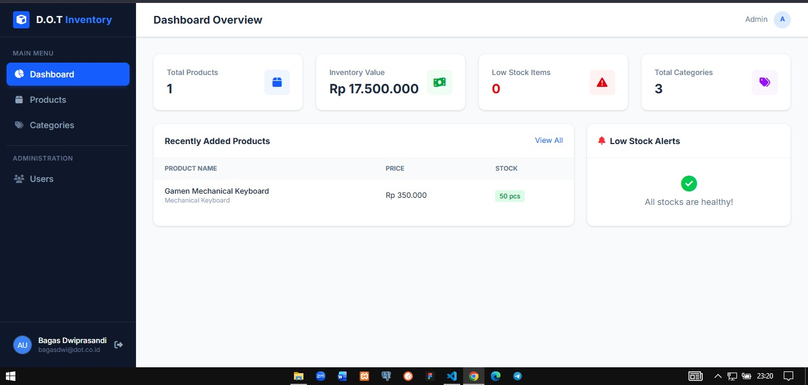
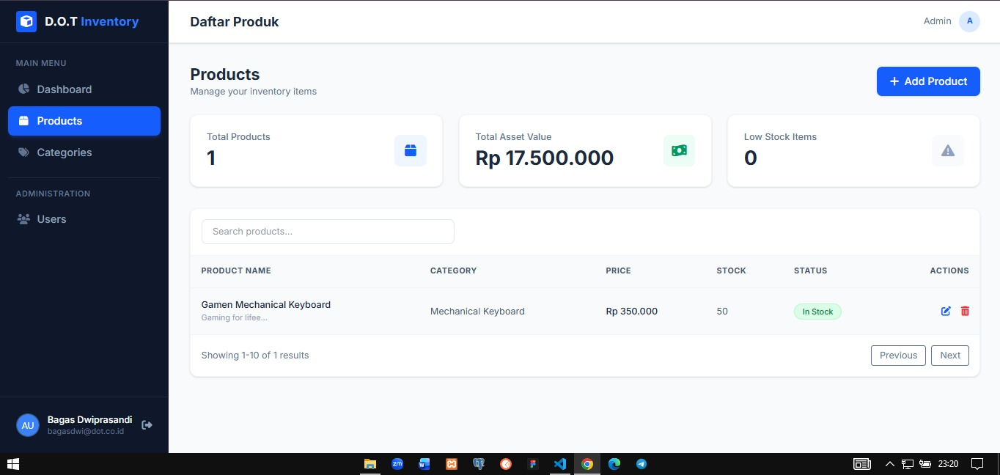
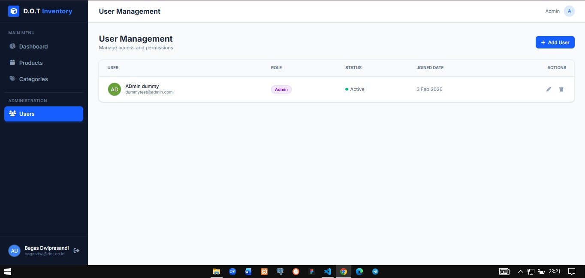
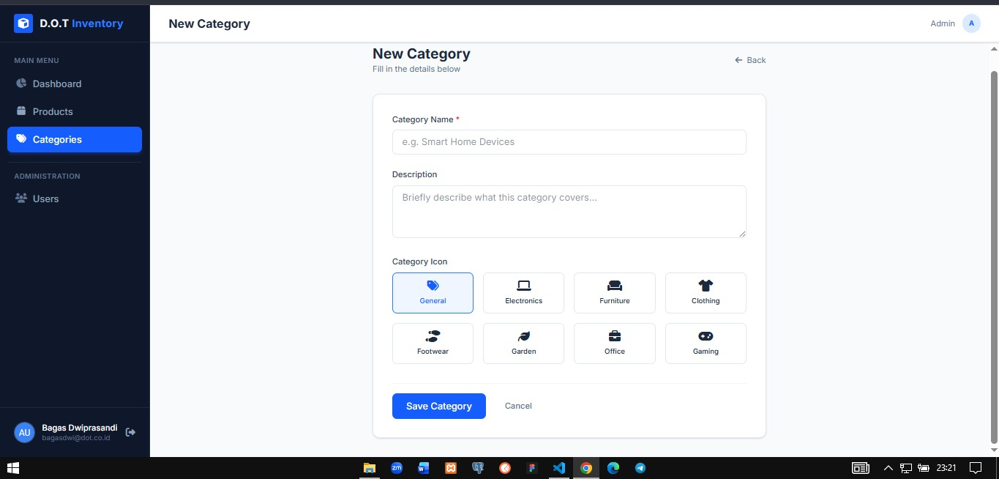

# 📦 DOT Inventory - Fullstack Management System

DOT Inventory is a modern, server-side rendered inventory management application designed to streamline product tracking and team collaboration. Built with **NestJS** and **TypeScript**, it strictly follows the **MVC (Model-View-Controller)** architecture pattern.

## 🚀 Features

### 📊 Dashboard & Analytics

- **Real-time Stats:** View total products, asset value, and category counts instantly.
- **Low Stock Alerts:** Visual indicators for items running low on stock.
- **Recent Activity:** Track recently added items.

### 📦 Product & Category Management (CRUD)

- **One-to-Many Relation:** Organize products under specific categories.
- **Dynamic Forms:** Add/Edit products with auto-populated category dropdowns.
- **Rich Data:** Manage stock levels, pricing (IDR currency), and descriptions.

### 👥 User Management & Security

- **Secure Authentication:** Implementation of `bcrypt` for password hashing.
- **Role-Based Badges:** Visual distinction between Admin, Manager, and Staff.
- **Auto-Avatar:** Automatic profile picture generation based on user initials.
- **Strict Validation:** Regex-based password strength enforcement (Uppercase, Symbol, Number).

---

## 🛠 Tech Stack & Dependencies

- **Framework:** [NestJS](https://nestjs.com/) (Node.js Framework)
- **Language:** TypeScript
- **Database:** PostgreSQL (via Supabase)
- **ORM:** TypeORM
- **View Engine:** EJS (Embedded JavaScript)
- **Styling:** Tailwind CSS (CDN)
- **Security:** Bcrypt, Class-Validator, Helmet

---

## 🗄️ Database Design

The application uses a Relational Database with a **One-to-Many** relationship:

1.  **Users Table:** Stores credentials (`email`, `hashed_password`) and `role`.
2.  **Categories Table:** Stores category metadata (`name`, `icon`).
3.  **Products Table:** Stores inventory data (`name`, `price`, `stock`) and holds a Foreign Key linking to `Categories`.

> _Relationship: One Category has Many Products._

---

## 📸 Screenshots

|              Dashboard Overview              |                Product List                |
| :------------------------------------------: | :----------------------------------------: |
|  |  |

|                User Management                 |                Add New Category                |
| :--------------------------------------------: | :--------------------------------------------: |
|  |  |

---

## ⚙️ Installation & Setup

Follow these steps to run the project locally:

1.  **Clone the repository**

    ```bash
    git clone `https://github.com/bagasdprs/DOT-Inventory-CMS.git`
    cd inventory-pro
    ```

2.  **Install Dependencies**

    ```bash
    npm install
    ```

3.  **Environment Setup**
    Create a `.env` file in the root directory and configure your database connection:

    ```env
    DB_HOST=your-supabase-host.com
    DB_PORT=5432
    DB_USERNAME=postgres
    DB_PASSWORD=your-password
    DB_NAME=postgres
    ```

4.  **Run the Application**

    ```bash
    # Development mode
    npm run start:dev
    ```

5.  **Access the App**
    Open your browser and navigate to: `http://localhost:3000`

---

## 📝 MVC Implementation Details

- **Model (Entities):** Defined in `src/*/entities/*.entity.ts` using TypeORM decorators.
- **View (EJS):** All UI templates are stored in `views/` folder, rendering dynamic content from the controller.
- **Controller:** Located in `src/*/controllers/`, handling HTTP requests and returning rendered pages.

---

## 🔐 Access Demo

To test the authentication features, you can use the following credentials or register a new account:

- **Email:** admin.dot@dummy.com
- **Password:** AdminDOT123!
- **Role:** Admin

<!-- ## 🎥 Video Demo

[Click here to watch the demo video](#) --- -->

Created by **Bagas Dwiprasandi** for Technical Challenge Submission.
